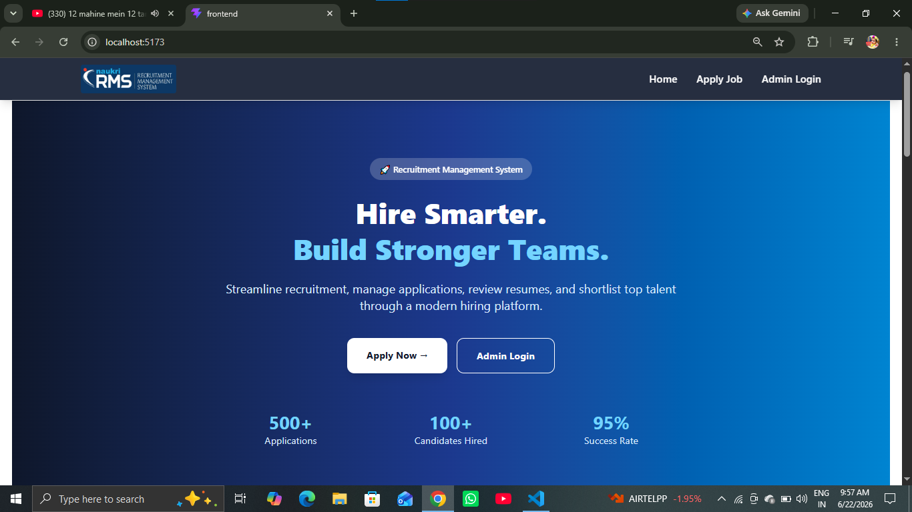
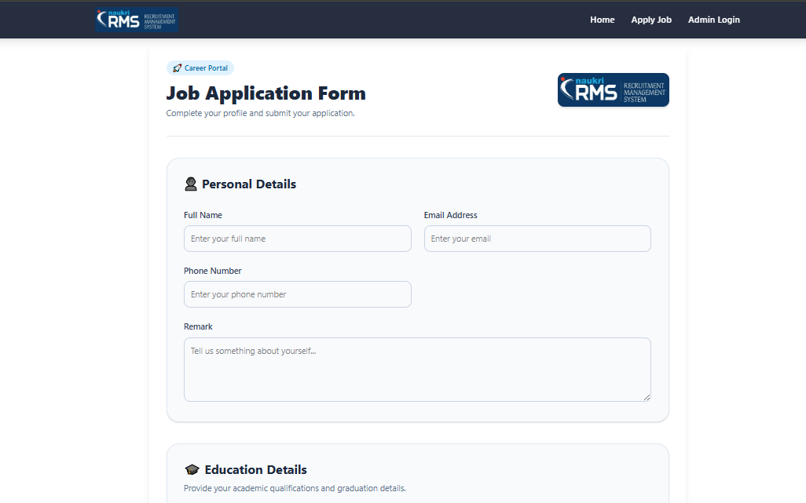
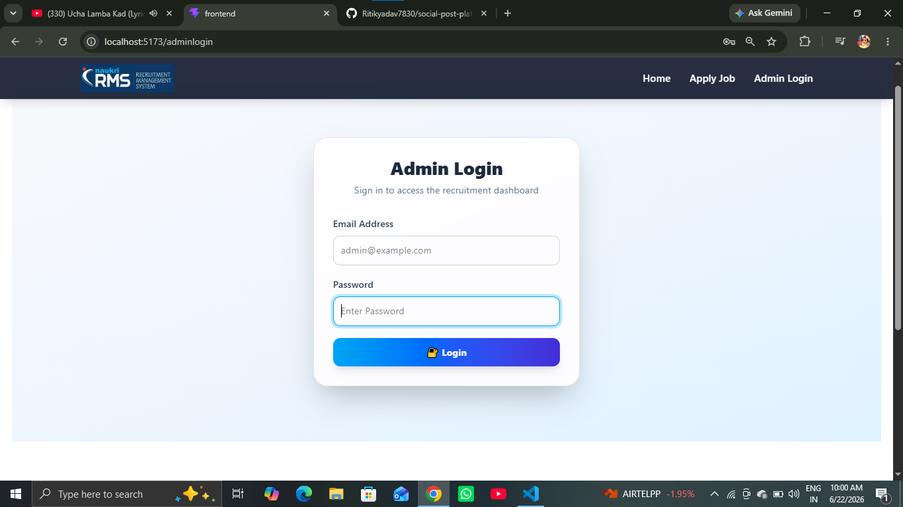
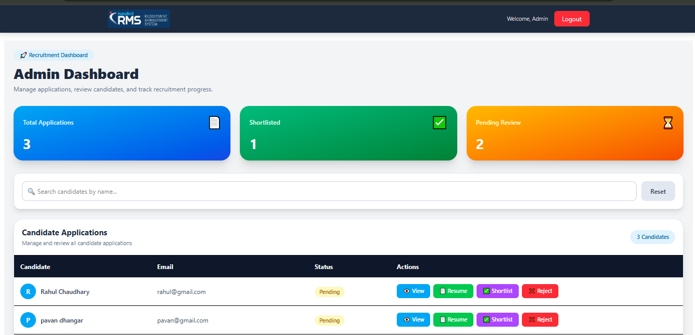
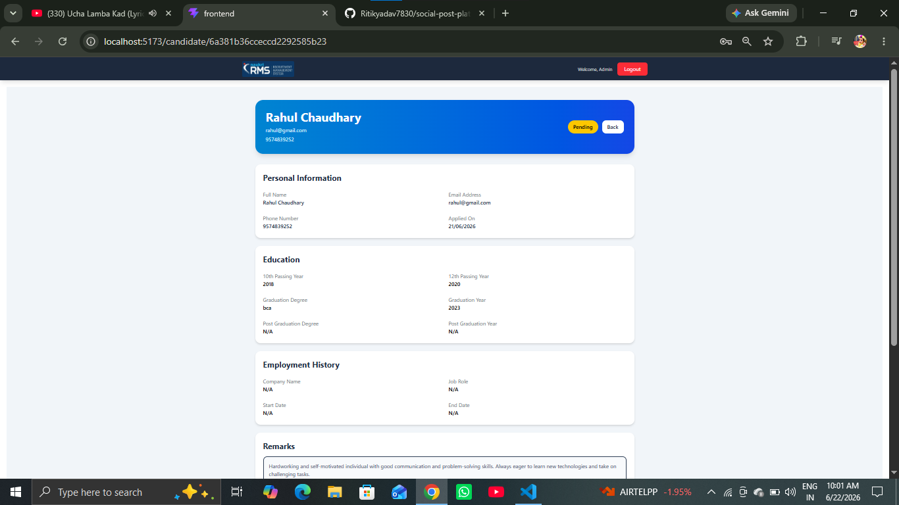

# Recruitment Management System

A full-stack Recruitment Management System built using the MERN stack that streamlines the hiring process by allowing candidates to submit job applications and enabling administrators to manage, review, and track applications through a centralized dashboard. The application features secure JWT-based authentication, candidate management, application status tracking, file uploads, and a responsive user interface.

## Live Demo

🌐 Frontend: https://your-frontend-url.vercel.app

---

## Features

### Candidate Features

* Submit Job Applications
* Upload Resume/Documents
* Enter Personal and Educational Details
* Apply Through Responsive Application Form

### Admin Features

* Secure Admin Authentication
* Dashboard Overview
* View All Applications
* Search Candidates
* Update Application Status
* Review Candidate Profiles
* Track Recruitment Progress

### Security Features

* JWT Authentication
* HTTP-Only Cookie Authentication
* Protected Routes
* Password Hashing using bcrypt
* Secure API Access

---

## Tech Stack

### Frontend

* React.js
* Redux Toolkit
* Tailwind CSS
* React Router DOM
* Axios

### Backend

* Node.js
* Express.js

### Database

* MongoDB Atlas
* Mongoose

### Authentication

* JWT (JSON Web Token)
* Cookie Parser
* bcrypt

### Deployment

* Vercel (Frontend)
* Render (Backend)
* MongoDB Atlas (Database)

---

## Screenshots

### Home Page



### Apply Job Page



### Admin Login



### Dashboard



### Candidate Details



---

## Folder Structure

```text
Recruitment-Management-System/
│
├── Backend/
│   ├── src/
│   │   ├── controllers/
│   │   ├── db/
│   │   ├── middleware/
│   │   ├── models/
│   │   ├── routes/
│   │   ├── utils/
│   │   ├── app.js
│   │   └── index.js
│   │
│   ├── public/
│   ├── package.json
│   └── .env
│
├── Frontend/
│   ├── src/
│   │   ├── Components/
│   │   ├── Pages/
│   │   ├── redux/
│   │   ├── assets/
│   │   └── App.jsx
│   │
│   ├── public/
│   ├── package.json
│   └── .env
│
└── README.md
```

---

## Installation

### Clone Repository

```bash
git clone https://github.com/Ritikyadav7830/Recruitment-Management-System.git
```

### Frontend Setup

```bash
cd Frontend
npm install
npm run dev
```

### Backend Setup

```bash
cd Backend
npm install
npm start
```


## Future Enhancements

* Email Notifications
* Interview Scheduling
* Multi-Admin Support

---

## Author

**Ritik Yadav**

* GitHub: https://github.com/Ritikyadav7830

---

Built with ❤️ using MERN Stack.
